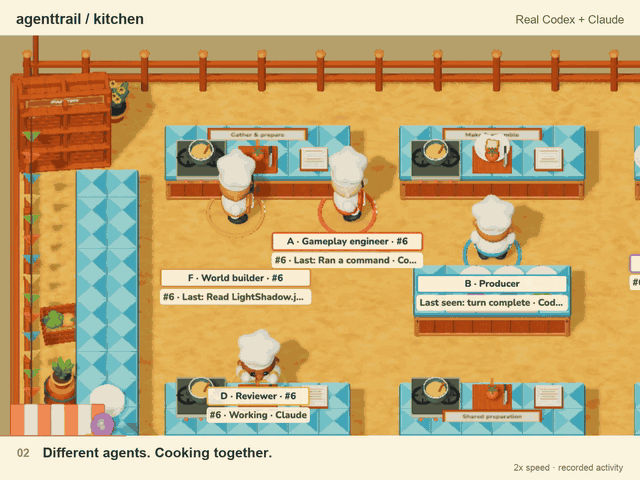

<div align="center">

<picture>
  <source media="(prefers-color-scheme: dark)" srcset="assets/brand/agenttrail-mark-dark.svg">
  
</picture>

# agenttrail

**See what your coding agents are doing—in a live project map or a shared 3D kitchen.**

[](https://www.npmjs.com/package/agenttrail-kitchen)
[](https://www.npmjs.com/package/agenttrail)
[](https://github.com/sodiumsun/agenttrail/actions/workflows/kitchen.yml)
[](LICENSE)

</div>

Agenttrail is a local, open-source monitor for AI coding agents. **Agenttrail Kitchen** turns their current work into chefs, shared dishes and deliveries. **Agenttrail Map** shows the durable plan, file activity and dependencies. Both live in this repository; each has its own command.

[](docs/kitchen/README.md)

*Recorded while real Codex and Claude sessions built a small 3D maze game. Chefs represent responsibilities, not necessarily separate agent processes.*

## Run Kitchen in your repo

You need **Node.js 20+**, a browser with WebGL, and a local project folder. Run this in the repo you want to watch:

```bash
npx agenttrail-kitchen .
```

The browser opens at **localhost:4780** (or the next free port). Keep this terminal open and keep working in your coding agent. Codex and Claude Code activity is discovered from available local logs. No `PLAN.md`, Agenttrail Map installation, copied files, API key or new agent session is required for basic observation. The watcher does not launch agents or edit your repo.

**Want to see it before connecting an agent?** Add `--example` to the command, then click **Next example step**. This is a labeled, scripted example. Click **Live** to return to your real repo.

**This is a public experimental preview.** The npm package includes the graphics and fonts, so users do not need a build step. To pin this release, use `npx agenttrail-kitchen@0.1.0-alpha.3 .`. The separate `npx agenttrail` command opens the Map.

[Kitchen guide](docs/kitchen/README.md) · [Connect agents and troubleshoot](docs/kitchen/CONNECTING.md) · [Release and verification](docs/kitchen/RELEASE.md)

## Watch the work become dishes



| In the kitchen | In your project |
| --- | --- |
| Chef | A project responsibility; the actual provider and session remain inspectable |
| Ticket / dish | An available native todo, with its own wording and status |
| Cooking | Observed work associated with that responsibility |
| Several chefs on one ticket | Contributions from roles or sessions associated with the same todo |
| Plate transfer | Explicit artifact revision and receipt metadata |
| Delivery conveyor | A native todo reported complete |

One session can move between several chefs as its work changes. Roles adapt to the project; you can refine them with an optional [workflow configuration](examples/kitchen-workflow). Multiple kitchens organize larger workflows. Click a chef or ticket to inspect its evidence.

**What happens automatically:** local activity, supported native todos, inferred responsibilities and todo completion. **What needs extra metadata:** confirmed handoffs and explicitly sharing one todo across separate sessions. The recorded multi-agent demo used these bindings; merely opening any repo does not create them. Missing plans stay **progress unknown**, and ending a turn does not mean a deliverable shipped.

## Use it with your coding agent or editor

| Tool | Kitchen connection | Current verification |
| --- | --- | --- |
| Codex CLI / local Codex desktop sessions | Reads available local session logs automatically | Real local collaboration exercised |
| Claude Code | Reads local project logs; optional additive hooks via **Connect agents** | Real local collaboration exercised |
| Cursor agents | Choose **Connect agents → Cursor** and review the repo hook setup | Adapter tests pass; native Cursor live validation pending |
| VS Code | Run the Kitchen command in its integrated terminal; use Codex or Claude Code as above | Browser companion; no Agenttrail editor extension shipped yet |
| Other tools | File changes remain visible; native sessions and todos need a supported adapter | File observation only |

For VS Code or Cursor, keep the browser beside your editor. The current integration is a **local companion**, not a Marketplace extension. Hook setup is explicit and reversible; restart an agent conversation if it does not load newly installed hooks.

Local observation has been exercised on macOS; automated package and adapter checks run on Linux. Windows and native Cursor validation remain pending. Cloud/remote sessions with no logs on the Kitchen host are not automatically discovered. [Details and limits](docs/kitchen/CONNECTING.md)

## Run the project map

The original map stays lightweight and independently installable:

```bash
cd your-repo
npx agenttrail
```


The Map combines declared intent in `PLAN.md` with observed file changes. A completed component lights up when its files change again. Current Claude Code runs and their todos appear through optional local hooks. Codex, Cursor and other tools contribute through file observation and the shared plan convention.

For the full component map, run `npx agenttrail init`, review the setup, then give your agent the backfill prompt from the board. It adds the convention to `CLAUDE.md` and `AGENTS.md`, creates a starter plan, and installs additive local Claude Code hooks. **Setup writes these files; normal watching does not.**

The map has a live file tree, dependency links, session trails and an overview of multiple repos. `npx agenttrail up` relaunches saved boards after a reboot; `npx agenttrail autostart` configures startup at login.

<details>
<summary><b>The PLAN.md convention</b></summary>

```markdown
# my project

## Capture the audio {#capture}
tech: coreaudio tap + ring buffer
files: [src/audio/**]
- [x] Grab the mic feed {#capture-mic}
  by: claude
- [~] Keep the last 30 seconds ready {#capture-ring}
  by: claude

## Classify the alerts {#classify}
needs: [capture]
links: [notify]
- [ ] Score events by urgency {#classify-score}
  from: roadmap

## decisions
- 2026-08-21: dropped redis for summaries; in-process queue instead
```

- Components use stable `{#id}` values and concrete, owner-readable names
- `files:` connects observed writes to the component they belong to
- `[~]` means working, `[x]` means done, and `[!]` means stuck
- `needs:` draws dependency arrows; `links:` draws dashed connections
- `by:` records who did the work; `from:` separates agent intent from roadmap intent
- `kind: knowledge` renders a component as a purple knowledge organ; `kind: human` renders it dashed in its own color — the step where a person enters the loop; `url:` makes the card clickable, opening the artifact it produces
- Backfilled completed tasks cite their implementing file as evidence
- Agents record plan-affecting decisions before they act on them

</details>

## Build Kitchen from source

```bash
git clone https://github.com/sodiumsun/agenttrail.git
cd agenttrail
npm ci --prefix packages/kitchen
npm run build --prefix packages/kitchen
npm start --prefix packages/kitchen -- --project /absolute/path/to/your/repo
```

Rebuild after frontend changes. The source, tests, original scene assets and third-party notices are all available in this repo. [Contributor setup and checks](CONTRIBUTING.md)

## Local by construction

Both services bind to **127.0.0.1**. No account, telemetry, transcript upload, model calls or cloud service is required. Fonts and graphics are bundled locally. Kitchen reads bounded local metadata and sends only allowlisted activity fields to its browser; task titles and project paths can still be visible on screen.

The Map is a dependency-free Node daemon and a static page. Kitchen is a separate package with a bundled Three.js frontend. Neither controls your agents, sends prompts, approves actions or marks their tasks complete.

## FAQ

**Will this work in an existing repo?** Yes, run the Kitchen command from its folder. Git and `PLAN.md` are optional. A live coding session needs accessible local Codex/Claude logs or configured Cursor hooks. If no activity is available, the chefs wait; use Example to explore the interface.

**Why is the kitchen quiet?** Check **Live**, the selected repo and **Connect agents**. Discovery can take about five seconds. Unsupported remote sessions, missing log history and agents waiting for input can all produce a quiet view. [Troubleshooting](docs/kitchen/CONNECTING.md#troubleshooting)

**Does the demo work without running an agent?** Yes: add `--example`, then advance with **Next example step**. Scripted example activity is labeled and separate from live observations.

**Where is the VS Code extension?** There is no Agenttrail Kitchen Marketplace extension yet. Run the companion from VS Code's integrated terminal and keep its browser view beside the editor. Cursor's optional hooks connect agent events; they are not an editor extension.

**Are six chefs six running agents?** Not necessarily. Chefs represent roles. Kitchen shows the real session count separately, so one session can contribute through several roles without pretending to run in parallel.

**Is a delivered dish a deployed feature?** It means the native todo was reported complete. Deployment, publication and artifact transfer require their own evidence.

**What changes in my repo?** Opening Kitchen does not change it. Optional hook installation edits only the reviewed provider settings. Optional `.office/kitchen.json` defines your workflow. Map `init` is a separate setup operation that creates the plan and agent conventions.

**What is still experimental?** Local provider log formats can change. Cursor's native live behavior and Windows remain unverified. Shared artifact receipts need explicit integration, and order history is reconstructed from available observations after restarting. No editor extension has been released yet.

## Contribute and license

[Report a bug](https://github.com/sodiumsun/agenttrail/issues) · [Contributing](CONTRIBUTING.md) · [Kitchen source](packages/kitchen) · [Third-party notices](packages/kitchen/docs/THIRD-PARTY.md)

MIT for the project code and original assets. The repository does not distribute Overcooked assets or soundtrack files; Kitchen is an independent cooking-game-inspired view.
