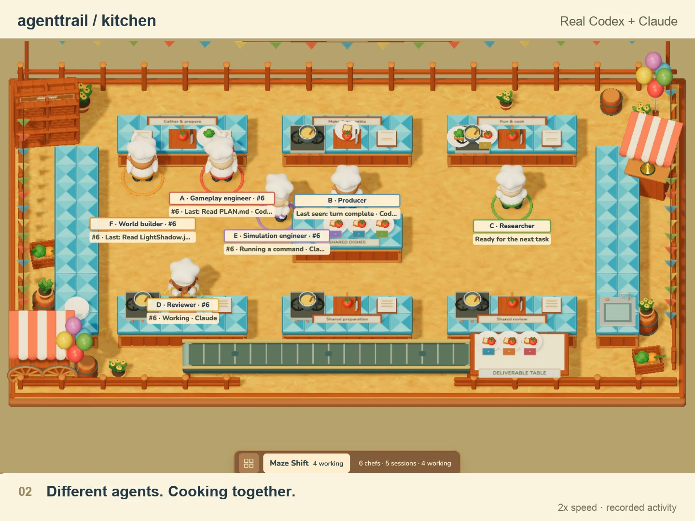

# Agenttrail Kitchen

Watch coding agents work through a shared 3D kitchen. Agenttrail's map shows project structure; Kitchen shows the current work as chefs, order tickets, ingredients and deliveries. Both belong to the same open-source project. Kitchen is an experimental, independently installed package.



## Start with your repo

Requires Node.js 20 or newer and a WebGL browser.

From a checkout of Agenttrail:

```sh
npm ci --prefix packages/kitchen
npm run build --prefix packages/kitchen
npm start --prefix packages/kitchen -- --project /absolute/path/to/your/repo
```

Or, from your working repo, run the prebuilt archive from the [experimental release](https://github.com/sodiumsun/agenttrail/releases/tag/kitchen-v0.1.0-alpha.2):

```sh
npm exec --yes --package=https://github.com/sodiumsun/agenttrail/releases/download/kitchen-v0.1.0-alpha.2/agenttrail-kitchen-0.1.0-alpha.2.tgz -- agenttrail-kitchen .
```

The browser opens at localhost:4780 or the next available port. Choose **Open repo** to switch folders. You can watch up to 12 roots without restarting agents. No PLAN.md is required; available native activity supplies the view. The source map command, `npx agenttrail`, keeps its existing behavior and installation footprint.

## Explore without running an agent

Add `--example` to the kitchen command, or click **Example** in the app. **Next example step** advances a labeled, scripted illustration of one session changing responsibilities while contributing to shared orders. It is not a recording of real providers. Click **Live** to return to the selected folder's observations.

## Read the kitchen

| What you see | What it means |
| --- | --- |
| Chef | A project responsibility, with actual assigned sessions visible in details |
| Order ticket and dish | An ephemeral native todo, following its reported wording and status |
| Chef cooking | Current observed work associated with that responsibility and dish |
| Ingredient plate | A recorded artifact revision or a clearly labeled workflow item |
| Plate transfer | Explicit receipt metadata; not a guess from matching filenames |
| Delivery conveyor | A newly completed native todo, not proof of a deployment or publication |
| Project map | Durable components, dependencies and configured outcomes |

One session can work through several chefs sequentially. Several sessions can contribute to one explicitly shared order. Similar todo titles alone do not establish collaboration. Inferred role matches stay labeled inferred. No native todo list means progress unknown.

Click a chef or ticket to inspect the evidence. Drag to pan, scroll to zoom, and use **Fit kitchen** or **Room view**. Motion pause and reduced motion stop decorative movement while live text still updates.

## Provider support

| Provider | Connection | Verification |
| --- | --- | --- |
| Codex | Experimental local logs | Real local collaboration exercised |
| Claude Code | Local logs; optional hooks | Real collaboration and native task receipts exercised |
| Cursor | Optional hooks | Automated coverage; native live validation pending |

Formats can change, and missing observations remain unknown. Only sessions with accessible local metadata can be discovered. [Connection details](CONNECTING.md) explain discovery limits and optional hook setup.

VS Code and Cursor can launch the browser companion from their integrated terminal. There is no Agenttrail Kitchen Marketplace extension or VSIX release yet. [Editor setup and troubleshooting](CONNECTING.md#vs-code-and-cursor)

## Customize and contribute

An optional `.office/kitchen.json` names responsibilities and groups rooms. The [portable workflow example](../../examples/kitchen-workflow) contains role/file mappings with no personal sessions or paths. Opening a project does not create this configuration automatically.

- [Shared dishes and native planning](SHARED-OUTCOMES.md)
- [Workflow configuration and role bindings](WORKFLOW-INTEGRATION.md)
- [Multiple kitchens](KITCHENS.md)
- [Explicit artifact receipts](HANDOFFS.md)
- [Contributing and checks](../../CONTRIBUTING.md)
- [Release notes](RELEASE.md)

The package is built from original project geometry and animation, using Three.js and locally bundled Nunito fonts. See [licenses and notices](../../packages/kitchen/docs/THIRD-PARTY.md). Soundtrack recordings and game-reference screenshots are excluded from the code distribution.
